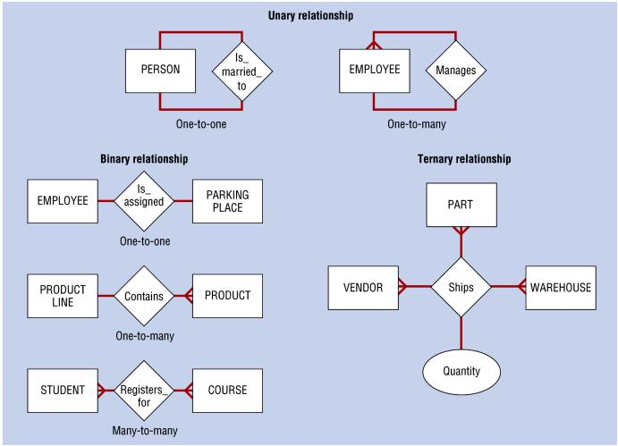
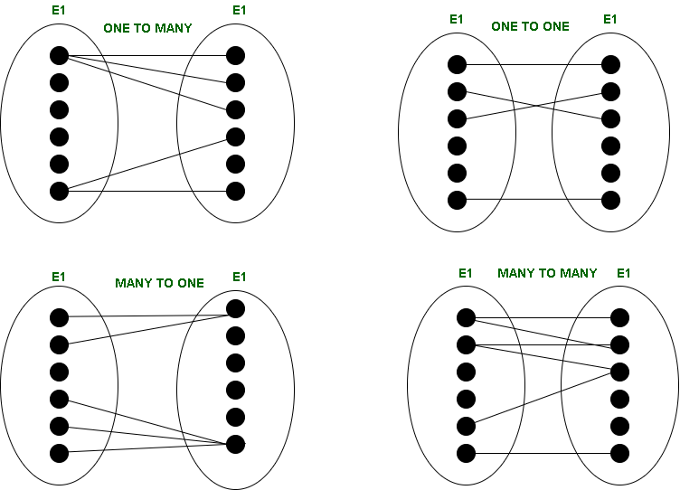
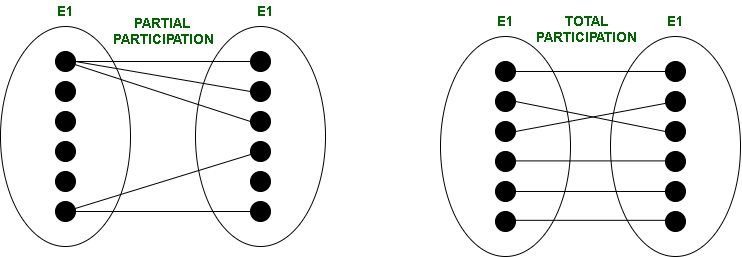

# DayOne from Date-Base ITI course
## Table of content :
1. [DB Life Cycle](#db-life-cycle)
1. [DB Design](#db-design)
1. [File Based system](#file-based-system)
1. [DB Systems](#db-system)
1. [ERD(Entity Relationship Diagram)](#erd)
    * [componants](#componants)
    * [type of Attributes](#type-of-attributes)
    * [Relationships](#Relationships)
---
## DB life cycle :
1. **Analysis**
    * by system analyst
    * scope (req Doc)
1. **DB Design**
    * by DB desinger 
    * make ERD(Entity Relationship Diagram)
1. **DB mapping**
    * set of rules to get actual schema and tables.
1. **DB implementation**
    * phsical DB
    * need RDBMS tool like {sql server , mysql ,access}
    * RDMS (Relationship Data Base Mangement Systems)
1. **make APP** or GUI or interface to help user to use DB
---
## File Based system :
### Type of file :-
* Delimited file
* Fixed width file
## **disadvantages of file based system** :
1. low perfomance
1. diff edit
1. separated copies
1. no realationships
1. no DB integrity
1. DB duplication
1. long Development time
1. security & permissions
1. no constraints & rules
1. no data qulity
1. no standard
1. diff integration
---
## DB System :
* tables & Relationships
### **advantages** :
1. one standard
1. **MetaData && Data**
    * **metaData**: data about data like (table name , attributes)
    * **data** : data itself (values)
1. **column had Data type**
1. **primary Key** : unique attrbuts and not null
1. **foreign key**
1. **centralized DB and shared**
---
# ERD :
**ERD has three main componants :-**
1. `Entites`       : entity is a definable thing or concept within a system, such as a person/role (e.g. Student), object .
1. `Attributes`    : property or characteristic of the entity that holds it. 
1. `Relationships` : two entities are associated with each other somehow. 
1. `Strong Entity` : an entity has primary key.
1. `Weak entity`   : an entity set don't have suffcient attributes to form primary key.
1. `parital key`   : set of attributes that can be associated with primary ke fo an owner entity set to distingush a weak entity

---

## type of Attributes :
1. `Simple` : contain only one value
1. `Composite` : an object that includes several nested simple attributes.
1. `Derived` : An attribute that can be derived from other attributes is derived attributes. 
1. `multi-valued` : The attribute which takes up more than a single value for each entity instance is a multi-valued attribute. 
1. `complex` : Those attributes, which can be formed by the nesting of composite and multi-valued attributes.

---

## Relationships :
> A Relationship Type represents the association between entity type.

Properties of realtion:
1. **Degree of Relation.**
    * `Unary`  : When there is only ONE entity set participating in a relation.
    * `Binary` : When there are TWO entities set participating in a relationship.
    * `Ternary`: When there are n entities set participating in a relation,
    * 

1. **Cardinality**
    * `one to one`   : When each entity in each entity set can take part only once in the relationship.
    * `one to many ` : In one-to-many mapping as well where each entity can be related to more than one relationship .
    * `many to many` : When entities in all entity sets can take part more than once in the relationship.
    * 

1. **Participation**:  Participation Constraints tell us that the participation in a relationship can either be total or partial. 
    * `Total`   : When each entity in an entity set participates in a relation.(all of them)
    * `Partial` : when all entities in the given entity set do not participate in a relation. (not all of them)
    * 

